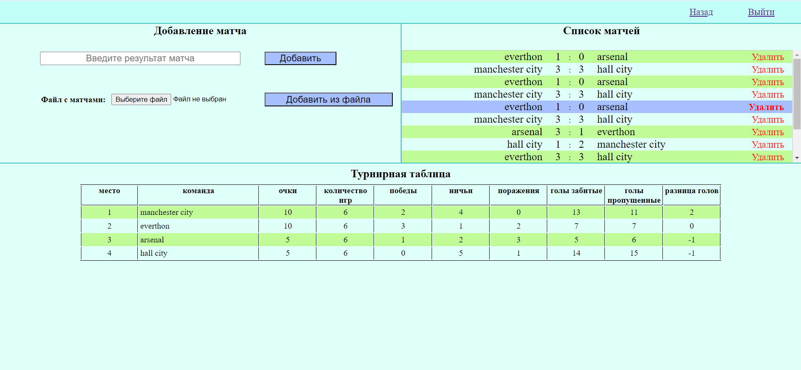

# Турнирная таблица (версия 2)
Веб-приложение, создано для изучения Java Spring Boot, MVC, Data JPA, HTML, CSS, JavaScript.

Веб-приложение для заведения результатов матчей и просмотра итоговой турнирной таблицы. Пользователь авторизуется или регистрируется, добавляет новый турнир или заходит в существующий, добавляет матчи по одному или грузит из файла txt, смотрит турнируню таблицу по результатам матчей.

СУБД PostgreSql 13(пролить в БД все скрипты из 001.sql, собрать проект, запустить jar.

https://github.com/maratango/standings_2